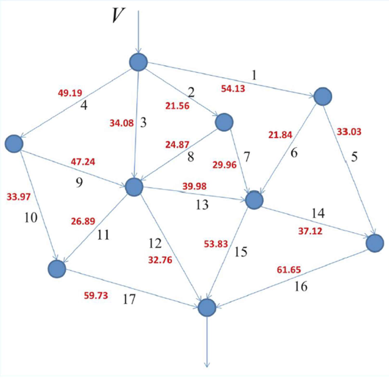

#  Genetic Algorithm for Network Optimization

Optimization of traffic flow in a road network using **MATLAB’s Genetic Algorithm**, applied to a nonlinear objective function with flow conservation and capacity constraints.

Developed as part of the course **Optimization Techniques** at the Aristotle University of Thessaloniki (AUTH), School of Electrical & Computer Engineering.

---

##  Problem Overview

A traffic network with **9 intersections (nodes)** and **17 roads (edges)** is modeled. Each road has a specific capacity and a congestion-sensitive travel time. The objective is to **minimize the total travel time per vehicle** by distributing traffic optimally, while satisfying:

- **Flow conservation** at all internal nodes  
- **Inflow = outflow** condition  
- **Per-road capacity limits**

---

## 🗺 Network Diagram



Red numbers indicate road capacity \( c_i \) (vehicles/min). Each arrow represents a one-way traffic path between intersections.

---

##  Travel Time Function

The delay for road \(i\) is modeled by the nonlinear function:

.png)

Where:
- \( t_i \): base (uncongested) travel time  
- \( a_i \): congestion factor  
- \( x_i \): flow on road \(i\)  
- \( c_i \): road capacity  

The total network cost is:

f(x) = ∑ᵢ xᵢ · Tᵢ(xᵢ)


---

##  Methodology

We solve the nonlinear constrained optimization problem using MATLAB’s built-in **Genetic Algorithm (`ga`)**. This choice is robust to local minima and does not require gradient information.

###  Constraints
- Linear equality constraints: **Aₑq · x = bₑq**
- Bound constraints: **0 ≤ xᵢ ≤ cᵢ**
- Flow conservation is built into `Aeq`, `beq`

---

##  Experiments

###  Baseline Optimization
- **File:** `optimize_flow_baseline.m`
- **Traffic inflow:** \( V = 100 \) vehicles/min

###  Robustness Analysis
- **File:** `optimize_flow_variable_V.m`
- **Tested inflows:** \( V = 85, 95, 105, 115 \)
- For each V, the GA is run and convergence plots are generated.

---

##  Repository Structure
```
genetic-algorithm-for-network-optimization
├── src/
│ ├── travel_time_objective.m # Objective function f(x)
│ ├── optimize_flow_baseline.m # GA run for V = 100
│ └── optimize_flow_variable_V.m # GA runs for V ∈ {85, 95, 105, 115}
├── images/
│ ├── network_diagram.png # Network structure
│ └── Ti(xi).png # Travel time function 
├── report.pdf # Project report with equations and results
└── README.md
```


---

## Tools Used
- MATLAB
- Optimization Toolbox
- Global Optimization Toolbox

---

##  Author

**Panagiotis Koutris**  
Student at AUTH – School of Electrical & Computer Engineering

---

##  License

Licensed under the [Apache 2.0 License](https://www.apache.org/licenses/LICENSE-2.0.html).
